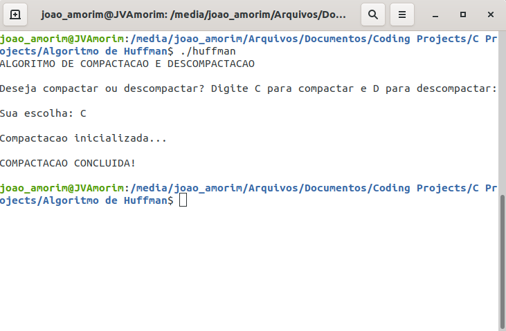
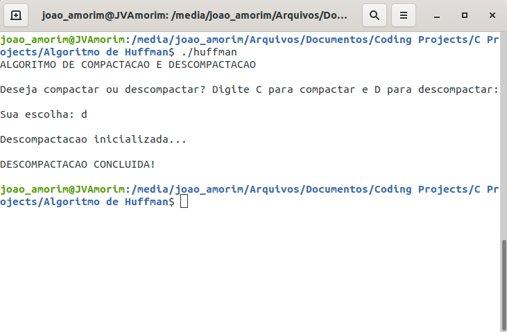
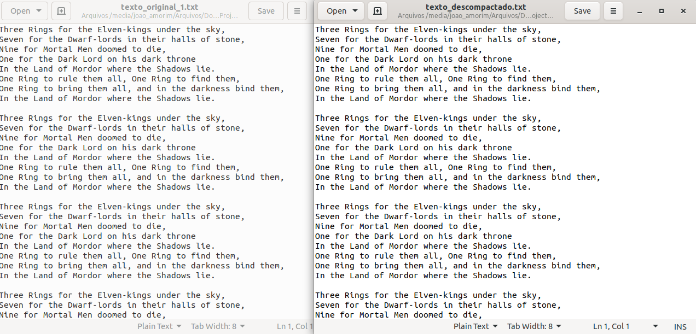

<h1 align="center">
    Algoritmo de Compactação e Descompactação de Arquivos Texto por Árvores de Huffman
</h1>

  

  
  
  

  

  <a href="#descrição">Descrição</a>&nbsp;&nbsp;&nbsp;|&nbsp;&nbsp;&nbsp;
  <a href="#instruções">Instruções</a>&nbsp;&nbsp;&nbsp;|&nbsp;&nbsp;&nbsp;
  <a href="#observações">Observações</a>&nbsp;&nbsp;&nbsp;|&nbsp;&nbsp;&nbsp;
  <a href="#licença">Licença</a>

 

  
  
  

## Descrição

O algoritmo realiza a compactação e descompactação de arquivos texto através da técnica de Árvores de Huffman.

## Instruções

### Configuração

Antes de realizar a compilação do algoritmo, configure as seguintes variáveis no arquivo main.c:
 - `arquivo_input_compactar`: endereço e nome do arquivo texto que deseja compactar.
 - `arquivo_output_compactar`: endereço e nome do arquivo binário de saída. Trata-se do texto compactado.
 - `arquivo_input_descompactar`: endereço e nome do arquivo binário que deseja descompactar.
 - `arquivo_output_descompactar`: endereço e nome do arquivo texto de saída. Trata-se do texto descompactado.
 
(Caso os arquivos estejam na mesma pasta do código fonte, basta digitar os nomes dos arquivos (com a extensão .txt).)

Após realizar a configuração das variáveis acima, basta compilar (instruções abaixo) e depois iniciar o executável gerado.

Há dois arquivos incluídos no projetos que podem ser utilizados como testes: `texto_original_1.txt` e `texto_original_2.txt`.

### Compilação

Após ter configurado as variáveis acima, assegure-se de ter no seu computador os seguintes items instalados, para possibilitar a compilação:
- [GCC (compilador);](https://gcc.gnu.org/install/download.html)
- [Make.](https://www.gnu.org/software/make/)

Com esses dois items instalados, basta rodar a linha de comando `make all` no seu shell de preferência, após navegar até a pasta contendo os arquivos de código-fonte.

### Execução

Com a compilação realizada, abra o executável digitando na linha de comando `./huffman`, caso esteja em uma distro Linux, ou simplesmente dando um duplo-clique no executável, caso esteja no Windows. Com o executável aberto, digite C caso o desejado seja realizar uma compactação ou D, caso o desejado seja realizar uma descompactação. O último passo é só aguardar o algoritmo rodar e realizar o processo de compactação ou descompactação.

## Observações

- O algoritmo compacta e descompacta qualquer arquivo texto que possua caracteres entre 0 e 127 na tabela ASCII, sendo facilmente modificável para incluir os caracteres extendidos (127 a 256 na tabela ASCII).

- A compactação é realizada rapidamente mesmo para arquivos com tamanho acima de 1MB de arquivo. Lembre-se que um char ocupa 1 byte.

- A descompactação infelizmente demora muito tempo para ser concluída em arquivos muito grandes (acima de 40 kB já demora alguns minutos). Isso acontece devido ao método utilizado para identificar qual caractere está sendo lido no arquivo binário, onde é chamada uma função recursiva que lê bit por bit do arquivo para percorrer a Árvore de Huffman, parando ao encontrar o nó folha que contém o caractere correto a ser gravado.
Há otimizações que podem ser feitas, tornando possível um descompactação muito mais rápida, que não foram implementadas neste projeto, já que se trata apenas de um projeto de estudo.
Caso deseje implementar essas otimizações, basta seguir a mesma ideia que alguns usuários do Stack Overflow implementaram:

  [How to decode huffman code quickly?](https://stackoverflow.com/questions/2235208/how-to-decode-huffman-code-quickly)
  
  [Huffman code with lookup table](https://stackoverflow.com/questions/29890348/how-to-efficiently-decompress-huffman-coded-file)
  
  [How to efficiently decompress huffman coded file](https://stackoverflow.com/questions/13804629/huffman-code-with-lookup-table)

## Licença

Esse projeto é licenciado pela MIT License. Veja a página da [licença](https://opensource.org/licenses/MIT) para detalhes.
